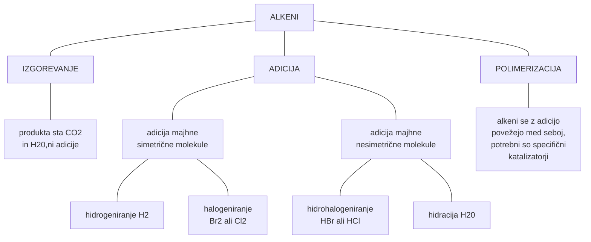

# Kemijske reakcije alkenov

---

- simetrične adicije
	- hidrogeniranje
	- halogeniranje
- asimetrične adicije
	- hidrohalogeniranje
	- hidracija
- polimerizacija

---

# Adicije

## 1. Simetrične adicije

### Hidrogeniranje
Adicija vodika na dvojno vez

                                           H   H
	                        Ni or Pt       |   |
	H2C = CH - CH3  +  H2  ----------->  H2C - CH - CH3
	      propen               150 C        propan 
	                           12-15 atm
	                           tlak

### Halogeniranje
Adicija halogena

	2-buten  +  klor  -->  2,3-diklorobutan

## 2. Asimetrične adicije

### Hidrohalogeniranje

	eten  +  HCl  -->  kloroetan (katalizator ni potreben)

### Hidracija

                   H2SO4
	eten  +  H20  ------>  etanol

---

# Polimerizacija

Enota = monomer 
![[OKEM-Alkeni-20240421171146899.webp]]

	H   H     H   H                     H   H   H   H
	|   |     |   |    katalizator      |   |   |   |
	C = C  +  C = C   ------------->  - C - C - C - C -
	|   |     |   |                     |   |   |   |
	H   H     H   H                     H   H   H   H

![[OKEM-Alkeni-20240421172048108.webp]] | ![[OKEM-Alkeni-20240421172105095.webp]] | ![[OKEM-Alkeni-20240421172134002.webp]] | ![[OKEM-Alkeni-20240421172156442.webp]]
-- | -- | -- | --
polietilen | etilen (eten) | polipropilen | propilen
![[OKEM-Alkeni-20240421172235766.webp]] | ![[OKEM-Alkeni-20240421172249824.webp]] | ![[OKEM-Alkeni-20240421172259838.webp]] | ![[OKEM-Alkeni-20240421172332367.webp]]
poli(vinil klorid) (PVC) | vinil klorid | teflon | tetrafluoroetilen
![[OKEM-Alkeni-20240421172416543.webp]] | ![[OKEM-Alkeni-20240421172427438.webp]]
polistiren | stiren