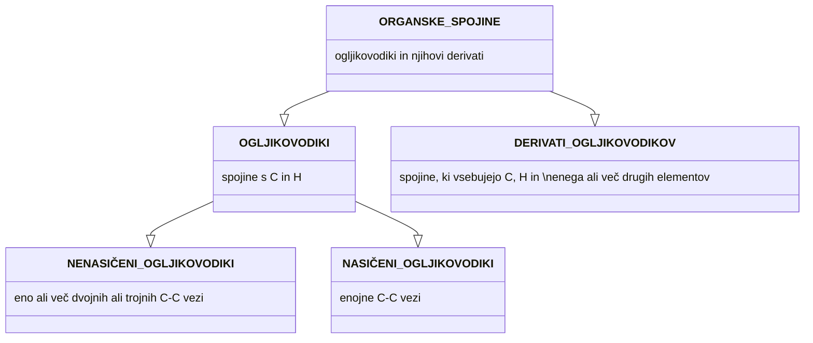
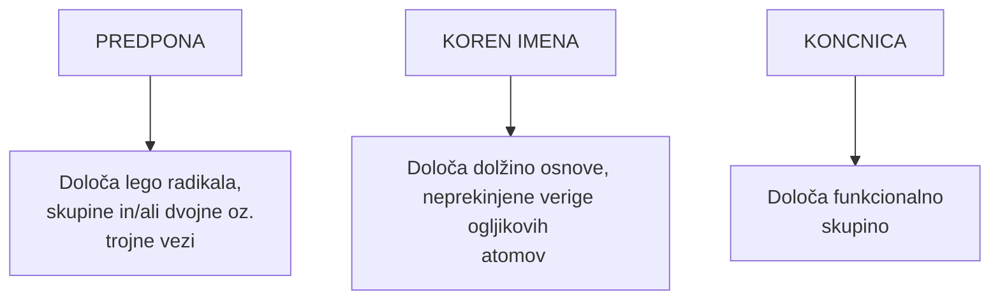

- organska kemija : [[BKEM/from lotus/OKEM-Ogljikovodiki| ogljikovodiki]] in njihovi derivati
- anorganska kemija : ostale spojine ($CO,\ CO_2,\ Na_2CO_3$, toda C ni vezan na vodik)

Organske | Anorganske
-- | --
kovalentne vezi | ionske vezi
netopne v vodi | topne v vodi
topne v organskih topilih | skoraj popolnoma netopne v organskih topilih
ne prevajajo električnega toka | prevajajo električni tok
gorijo | ne gorijo
počasne reakcije | hitre reakcije

### Zakaj veliko število organskih spojin?
- zaradi možnih oblik hibridizacije ($sp^3,\ sp^2 \text{ in sp}$)
- velika energija vezi med C-C, ki je višja od kateregakoli para v 2. in 3. periodi
- velika energija C-H vezi
- nizka razlika elektronegativnosti H in C $\implies$ C-H vezi so nepolarne $\implies$ v večini reakcij se ne pretrgajo

### 4 načini vezi ogljika
![[Pasted image 20240419222530.png]] | ![[Pasted image 20240419222544.png]] | ![[Pasted image 20240419222552.png]] | ![[Pasted image 20240419222601.png]]
-- | -- | -- | --
4 enojne | 2 enojni, 1 dvojna | 1 trojna in 1 enojna | 2 dvojni

### Število vezi, ki jih tvorijo atomi
Glede na skupino v kateri so na periodnem sistemu

H | C | N | O | S | F | Cl | Br | I
-- | -- | -- | -- | -- | -- | -- | -- | --
1 | 4 | 3 | 2 | 2 | 1 | 1 | 1 | 1

![[Pasted image 20240419223153.png]]

---

# Delitev

---

# Osnovno načelo poimenovanja

- ALK (koren) -AN (končnica; enojne vezi)
- ALK (koren) -EN (končnica; dvojna vez)
- ALK (koren) -IN (končnica; trojna vez)
 
- CIKLO (predpona) -ALK (koren) -AN (koncnica...)

---

# Funkcionalne skupine

formula | vrsta
-- | --
-COOH | karboksilne kisline
-COO-R | estri
-CO-R | acil-halogenidi
-CONH2 | amidi
-CN | nitrili
-CHO | aldehidi
-CO- | ketoni
-OH | alkoholi, fenoli
-NH2 | amini
-O-R | etri

---
# Osnovna pravila za poimenovanje

1. Poišči **najdaljšo** verigo ogljikovih atomov in jo poimenuj glede na število C atomov.
2. Oštevilči C atome s tiste strani, s katere bo imel C-atom, na katerega je vezana alkilna skupina (radikal, substituent), **najnižje** možno število.
3. Če je prisotna samo ena alkilna skupina, jo poimenujemo in povemo njeno **pozicijo** (2-metilpentan, 2-metilheksan).
4. Če je na osnovno verigo vezanih več enakih alkilnih skupin, napišemo njihove pozicije, njihovo število pa označimo s **preponami** di-, tri-, tetra-, penta- (2,4-dimetilpentan, 3,3- dimetilpentan).
5. Kadar sta na osnovno verigo vezani dve alkilni slupini, vsako posebej oštevilčimo in ju poimenujemo po **abecednem** vrstnem redu (3-etil-2-metil-pentan, 3-etil-4,5-dipropiloktan).
 
*2-etil-3-hidroksilbutanojska kislina*
![[Pasted image 20240419233615.png|300]]

---

[[BKEM/from lotus/OKEM-Ogljikovodiki]]

[[BKEM/from lotus/OKEM-Alkoholi]]
